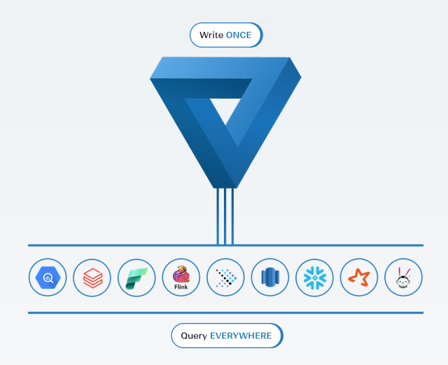
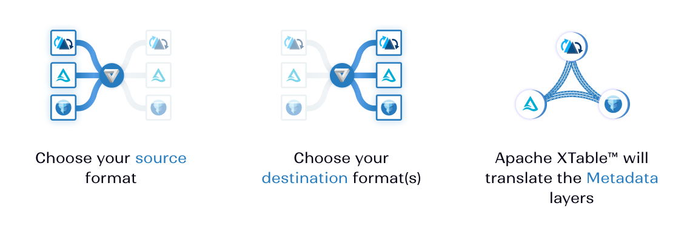
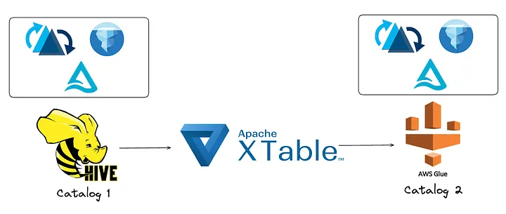
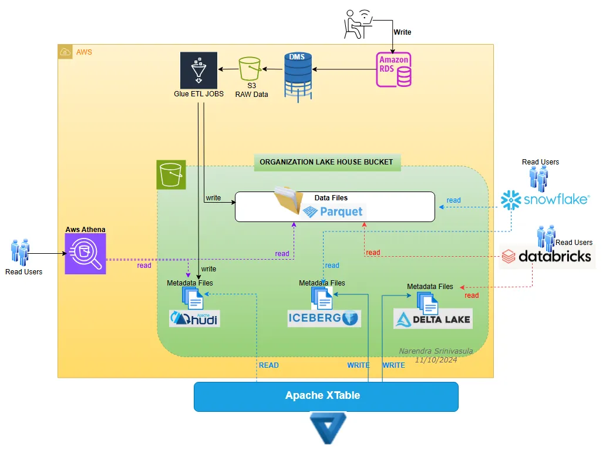
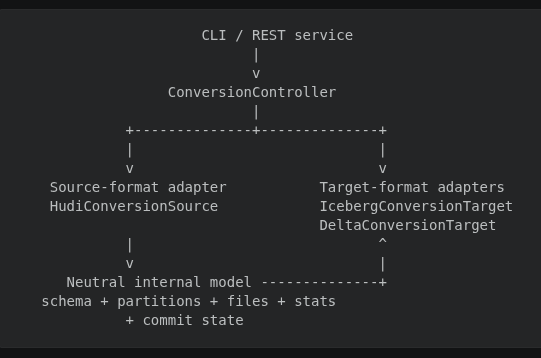
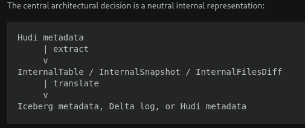
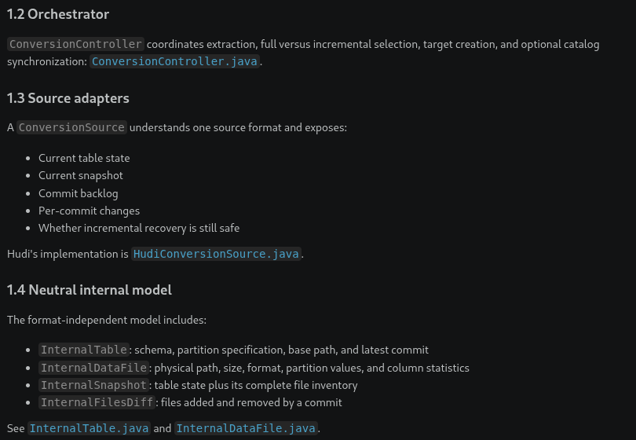

# Questions
Things that came to my mind
1. What about the performance of data translation? How good it is when transforming thousands of GBs of data?

# 1. Context

## From warehouses to transactional data lakes

Data architectures have evolved to support larger data volumes and a broader
range of workloads. Traditional data warehouses offered reliable, high-performance
analytics for structured data, but they were commonly tied to proprietary storage
and compute systems. Data lakes introduced cheaper, scalable storage and the
flexibility to retain structured, semi-structured, and unstructured data in open
file formats. For analytical data, columnar formats such as Apache Parquet became
common.

However, files alone do not provide table-level guarantees. Managing concurrent
writes, schema changes, partitions, and historical versions directly on a data
lake is difficult. Open table formats (OTFs) such as Apache Hudi, Apache Iceberg,
and Delta Lake address this gap by maintaining a transactional metadata layer
over the underlying data files. They provide capabilities such as ACID
transactions, schema evolution, partition management, snapshots, and time
travel.

## A new problem: table-format fragmentation

Organizations choose a table format according to their workloads, existing
platform, query engines, and vendor ecosystem. In a large organization, different
teams may therefore adopt different formats. A team might ingest and maintain a
table in Hudi, while another engine or platform integrates more naturally with
Iceberg or Delta Lake.

This creates a new interoperability problem. Although these formats often
reference the same type of physical data files, each one represents table state,
transactions, schemas, partitions, and statistics differently. Making a table
available in another format has traditionally required a separate conversion
pipeline and, in many cases, rewriting or duplicating the data. At scale, that
means additional compute, storage, synchronization delay, and operational
complexity.

## Why XTable is needed

The need is not for another table format, but for a way to make the same data
readable through multiple table-format ecosystems. Apache XTable (Incubating)
addresses this by translating the metadata of one source format into one or more
target formats. The physical data files remain in place, while compatible
engines can interpret them through Hudi, Iceberg, or Delta Lake metadata.

This approach reduces the cost and duplication associated with conventional
format conversion, while allowing an organization to keep one authoritative
source format and expose secondary representations for other consumers. It does
not make every format-specific feature interchangeable, and the secondary
metadata remains synchronized rather than independently writable.

## Sources and further reading

- https://xtable.apache.org/
- https://xtable.apache.org/docs/features-and-limitations/
- https://xtable.apache.org/docs/how-to/
- https://xtable.apache.org/blog/OneTable-is-now-Apache-XTable/
- https://iceberg.apache.org/docs/latest/
- https://aws.amazon.com/blogs/big-data/run-apache-xtable-in-aws-lambda-for-background-conversion-of-open-table-formats/
- https://dipankar-tnt.medium.com/introducing-multi-catalog-sync-in-apache-xtable-incubating-unlocking-catalog-interoperability-8420f0f0223b

# 2. Explain the problem

# what is xtable

XTable is best understood as a metadata interoperability layer with one authoritative source table, not as an ETL engine or a bidirectional multi-writer database.

Apache XTable™ simplifies data lake operations by leveraging a common model for table representation. This allows users to write data in one format while still benefiting from integrations and features available in other formats. For instance, Apache XTable™ enables existing Hudi users to seamlessly work with Databricks's Photon Engine or query Iceberg tables with Snowflake. Creating transformations from one format to another is straightforward and only requires the implementation of a few interfaces, which we believe will facilitate the expansion of supported source and target formats in the future.

    Apache XTable™ provides cross-table omni-directional interop between lakehouse table formats
    Apache XTable™ is NOT a new or separate format, Apache XTable™ provides abstractions and tools for the translation of lakehouse table format metadata
    Apache XTable™ is formerly known as OneTable

# - check: When to use

Apache XTable™ can be used to easily switch between any of the table formats or even benefit from more than one simultaneously. Some organizations use Apache XTable™ today because they have a diverse ecosystem of tools with polarized vendor support of table formats. Some users want lightning fast ingestion or indexing from Hudi and photon query accelerations of Delta Lake inside of Databricks. Some users want managed table services from Hudi, but also want write operations from Trino to Iceberg. Regardless of which combination of formats you need, Apache XTable™ ensures you can benefit from all 3 projects.

# how it solves the problem

At a fundamental level, Hudi, Iceberg, and Delta Lake share similarities in their structure. When data is written to a distributed file system, these formats consist of a data layer, typically Parquet files, and a metadata layer that provides the necessary abstraction (see the following diagram). XTable uses these commonalities to enable interoperability between formats.
Apache XTable enables seamless conversion between these formats without data duplication or alterations, simply updating the metadata. 

how it works

The synchronization process in XTable works by translating table metadata using the existing APIs of these table formats. It reads the current metadata from the source table and generates the corresponding metadata for one or more target formats. This metadata is then stored in a designated directory within the base path of your table, such as _delta_log for Delta Lake, metadata for Iceberg, and .hoodie for Hudi. This allows the existing data to be interpreted as if it were originally written in any of these formats.

The most important architectural point is that XTable does not normally convert or rewrite the underlying records. It translates table-format metadata so the same physical data files can be interpreted as Hudi, Iceberg, or Delta tables. The official XTable tutorial confirms that this happens without copying or moving the underlying files.

Apache XTable™ reads the existing metadata of your table and writes out metadata for one or more other table formats by leveraging the existing APIs provided by each table format project. The metadata will be persisted under a directory in the base path of your table (_delta_log for Delta, metadata for Iceberg, and .hoodie for Hudi). This allows your existing data to be read as though it was written using Delta, Hudi, or Iceberg. For example, a Spark reader can use spark.read.format(“delta | hudi | iceberg>”).load(“path/to/data”). 

### 💡 Idea: Would be great understand and show the generated metadata

incremental: XTable writes XTABLE_METADATA into the target so the next run can continue incrementally.

### 💡 Idea: Would be nice work and demonstrate the catalog
POC: https://dipankar-tnt.medium.com/introducing-multi-catalog-sync-in-apache-xtable-incubating-unlocking-catalog-interoperability-8420f0f0223b

### 💡 Idea: Demonstrate an automated sync and conversion using lambda
POC: https://aws.amazon.com/blogs/big-data/run-apache-xtable-in-aws-lambda-for-background-conversion-of-open-table-formats/

Multi-Catalog Sync using Apache XTable

or example, a table registered in Hive Metastore (HMS) can now be made available in AWS Glue Data Catalog with a single configuration and execution step.

n the most basic sense, a catalog is an organized inventory of data assets within an organization. It keeps track of all tables and their metadata, table names, schemas, and references to specific metadata associated with each table’s format
Optionally register the table in external catalogs
Generating metadata/ or _delta_log/ does not necessarily register the table in Glue, HMS, or another catalog. Catalog synchronization is a subsequent, optional step.

Beyond vendor lock-in, another growing operational challenge is the fragmentation of catalog usage within organizations. Different teams may rely on distinct catalogs as part of the ecosystem they are part of — sometimes even different implementations of the same specification, such as the Iceberg REST Catalog.

The project currently documents HMS and AWS Glue support,
# - Architecture

# - Competitors
Delta Lake Uniform

# - Pros and Cons

## Pros

No data duplication

XTable normally writes metadata rather than copying or rewriting table data. This is faster and substantially cheaper for large tables.

Cross-engine interoperability

A Hudi-ingested dataset can be exposed through Iceberg or Delta metadata to engines that support those formats better.

Format-neutral core

The internal model prevents every format from needing direct converters to every other format:

Without neutral model: N * (N - 1) converters
With neutral model:    N sources + N targets
Incremental synchronization

After the initial snapshot, XTable can process only new source commits, reducing filesystem listing and metadata-generation work.

Safe fallback

When Hudi's retained timeline is insufficient, XTable detects that and performs a complete snapshot sync instead of applying an incomplete delta.

Preserves useful statistics

Partition values, record counts, and column statistics are translated so target engines can perform metadata and file pruning.

Extensible adapter interfaces

New targets implement ConversionTarget; source-specific logic remains isolated behind ConversionSource.

Per-target failure isolation

Multiple targets can be synchronized in one run, and one target's error does not necessarily prevent other formats from completing.
- Sync 
Apache XTable™ (Incubating) provides two sync modes, "incremental" and "full." The incremental mode is more lightweight and has better performance, especially on large tables. If there is anything that prevents the incremental mode from working properly, the tool will fall back to the full sync mode.

- Synchronizing table format metadata in external catalogs (CatalogSync)
In addition to synchronizing table format metadata, Apache XTable™ (Incubating) now allows users to synchronize metadata for tables across multiple external catalogs continuously and incrementally. This reduces friction by eliminating the manual step of registering tables in multiple catalogs and enhances flexibility by avoiding catalog lock-in. HMS and AWS Glue are the two catalogs supported right now, support for other catalogs (Unity, Apache Polaris, Apache Gravitino, DataHub) coming soon.

- Apache XTable™ (Incubating) synced tables behave the similarly to native tables which means you do not need any additional configurations on query engines' side to work with tables synced by Apache XTable™ (Incubating). 

### 💡 Idea: Make a POC with Querying from Amazon Athena ? to validate the above topic

### 💡 Idea: Make their POC https://xtable.apache.org/docs/demo/docker

## Cons

Unstructured data: Apache XTable is not designed to handle unstructured data.
Supported views: Apache XTable only supports Copy-on-Write or Read-Optimized views of tables.
Hudi and Iceberg MoR tables: Apache XTable does not support Hudi and Iceberg MoR tables.
Delta Delete Vectors: Apache XTable does not support Delta Delete Vectors

It is not complete semantic conversion

Only metadata representable by the internal model and target format is translated. Format-specific features can be lost.

No complete Hudi Merge-on-Read conversion

Merge-on-Read tables expose only their base-file/read-optimized state. Uncompacted changes in Hudi log files will not appear in the target view.

Delete-vector limitations

Delta and Iceberg deletion vectors are not currently represented. The documentation limits support to Copy-on-Write or read-optimized views. See the official limitations.

One authoritative writer is effectively required

The source format should remain authoritative. Independently writing through Hudi, Iceberg, and Delta metadata over the same files risks divergent histories and conflicting lifecycle operations.

Partition interpretation may require manual configuration

Hudi partition transforms sometimes require partitionSpec because directory paths do not retain enough information to infer the transformation reliably.

Schema edge cases are difficult

Field IDs, list encoding, generated columns, map-key evolution, requiredness, and format-specific type rules do not map perfectly.

Metadata synchronization is asynchronous

Target formats lag behind the source until the next XTable execution. Continuous mode narrows this window but does not make the formats one atomic transaction.

Full fallback can be expensive

When incremental history is unavailable, XTable must list and compare the entire table. This becomes costly for large tables or object stores.

Operational complexity remains

Operators still need storage credentials, compatible format libraries, retention settings, catalog registration, monitoring, and scheduling.

The REST service is relatively thin

The REST layer delegates directly to the same controller. It is not a complete job-control platform with durable queues, rich history, distributed scheduling, or a management UI.

almost 3 years old project
latest version is 0.3.0-incubating but 0.4.0-incubating-rc1 is on the way
still a very small community 

1. Hudi and Iceberg MoR tables not supported
2. Delta Delete Vectors are not supported
3. Synchronized transaction timestamps
With Apache XTable™ you pick one primary format and one or more secondary formats. The write operations with the primary format work as normal. Apache XTable™ than translates the metadata from the primary format to the secondaries. When committing the metadata of the secondary formats, the timestamp of the commit will not be the exact same timestamp as shown in the primary.

- Only Copy-on-Write or Read-Optimized views of tables are currently supported. This means that only the underlying parquet files are synced but log files from Hudi and delete vectors from Delta and Iceberg are not captured by the sync

- Check this: I need to know how complex is it, how to fix, if production data usually has these things

Hudi

    Hudi 0.14.0 is required when reading a Hudi target table. Users will also need to enable
        the metadata table (hoodie.metadata.enable=true) and
        hive style partitioning (hoodie.datasource.write.hive_style_partitioning=true) wherever applicable when reading the data.
    Be sure to enable parquet.avro.write-old-list-structure=false for proper compatibility with lists when syncing from Hudi to Iceberg.
    When using Hudi as the source for an Iceberg target, you may require field IDs set in the parquet schema. To enable that, follow the instructions here.

Delta

    When using Delta as the source for an Iceberg target, you may require field IDs set in the parquet schema. To enable that, follow the instructions for enabling column mapping here.
    When Delta is the source, Generated Columns are not synced to the target schema. For tables that are partitioned on Generated Columns, there is limited support. For example, we support date functions like transforming a timestamp to yyyy-MM-dd format. Please file a GitHub issue or pull-request for any cases that you think should be supported.

# - Tradeoffs

delta lake
- Delta Lake Uniform is a one-directional conversion from Delta Lake to Apache Hudi or Apache Iceberg. Uniform is also governed inside the Delta Lake repo. 

xtable

- Apache XTable™ provides abstraction interfaces that allow omni-directional interoperability across Delta, Hudi, Iceberg, and any other future lakehouse table formats such as Apache Paimon. Apache XTable™ is a standalone github project that provides a neutral space for all the lakehouse table formats to constructively collaborate together.

Metadata-only speed versus semantic completeness

Reusing existing files avoids expensive rewrites, but XTable cannot translate information that exists only in unsupported logs, delete vectors, indexes, or format-specific metadata.

Neutral model simplicity versus lowest-common-denominator behavior

InternalTable makes the system extensible, but any format feature that cannot fit the shared model needs an extension or is omitted.

Incremental performance versus retained-history dependency

Incremental sync is efficient only while the source timeline and cleaned files contain enough history. More aggressive Hudi cleaning saves storage but causes more full XTable synchronizations.

Multiple readable formats versus single-writer discipline

Several query engines can read the same data through their preferred format, but allowing all of them to write makes ownership and conflict resolution ambiguous.

Shared physical files versus coordinated lifecycle management

Storage use is minimized, but vacuuming or deleting a file through one format can break every other format whose metadata still references it. Data-file deletion policies must therefore be controlled centrally.

Preserved commit history versus exact historical equivalence

XTable creates corresponding target commits and records source identifiers, but timestamps, snapshot IDs, and transaction boundaries are target-specific. Histories are analogous, not identical.

Automatic fallback versus unpredictable runtime

Falling back to a full snapshot favors correctness, but a normally small incremental job can suddenly become a large filesystem scan.

Multi-target fan-out versus no cross-target atomicity

Hudi-to-Iceberg may succeed while Hudi-to-Delta fails. This improves availability but means consumers can temporarily see different source versions depending on their selected format.

Target-native metadata versus compatibility constraints

Native Iceberg manifests and Delta actions provide broad engine compatibility, but their schemas, partition semantics, field IDs, and protocols must remain within what both the original files and target readers support.

